# Project Structure

The project is organized around application ports, infrastructure adapters, domain-facing models, and focused tests.

```mermaid
flowchart TD
    Root["nn-genai-assessment"]

    Root --> Config["Project configuration\npyproject.toml / .env.example"]
    Root --> Docs["docs/"]
    Root --> Scripts["scripts/"]
    Root --> Source["src/nn_genai/"]
    Root --> Tests["tests/"]

    Docs --> Decisions["decisions.md"]
    Scripts --> Smoke["External-service smoke tests\nGemini / Tavily / RandomUser / research agent"]

    Source --> Main["main.py"]
    Source --> App["application/"]
    Source --> Agents["agents/"]
    Source --> Clients["clients/"]
    Source --> Infra["infrastructure/"]
    Source --> Models["models/"]
    Source --> Services["services/"]
    Source --> RuntimeConfig["config.py"]

    App --> Ports["ports/"]
    App --> Research["research/"]
    Ports --> ResearchAgentPort["research_agent.py"]
    Ports --> SearchPort["search_provider.py"]
    Ports --> RandomUserPort["random_user_client.py"]
    Research --> Ledger["evidence_ledger.py"]
    Research --> Validator["provenance_validator.py"]
    Research --> Quality["source_quality.py"]
    Research --> Normalizer["url_normalizer.py"]

    Agents --> ResearchTools["research_tools.py"]

    Clients --> RandomUserClient["random_user_client.py"]

    Infra --> InfraAgents["agents/"]
    Infra --> LLM["llm/"]
    Infra --> Search["search/"]
    InfraAgents --> LangChainAgent["langchain_research_agent.py"]
    LLM --> GeminiProvider["gemini_provider.py"]
    LLM --> GeminiModel["gemini_langchain_model.py"]
    LLM --> ProviderContract["provider.py"]
    LLM --> Prompts["prompts.py"]
    Search --> Tavily["tavily_search_provider.py"]

    Models --> Person["person.py / person_identity.py"]
    Models --> SearchResult["search_result.py"]
    Models --> Evidence["retrieved_evidence.py"]
    Models --> Draft["research_draft.py"]
    Models --> Result["research_result.py"]
    Models --> Status["research_status.py"]

    Services --> Identity["identity_service.py"]
    Services --> PersonService["person_service.py"]

    Main --> Services
    Main --> LangChainAgent
    LangChainAgent --> ResearchTools
    LangChainAgent --> ResearchAgentPort
    LangChainAgent --> Validator
    ResearchTools --> SearchPort
    ResearchTools --> Ledger
    Tavily --> SearchPort
    GeminiModel --> ProviderContract
    GeminiProvider --> ProviderContract
    RandomUserClient --> RandomUserPort
    Identity --> RandomUserPort
    Validator --> Ledger
    Validator --> Draft
    Validator --> Result

    Tests --> UnitTests["Unit and integration tests"]
    UnitTests --> ServiceTests["identity / person service"]
    UnitTests --> ClientTests["RandomUser client"]
    UnitTests --> ResearchTests["evidence / tools / Tavily / agent"]
    UnitTests --> Fakes["tests/fakes/\nFakeResearchModel / FakeSearchProvider"]
    Fakes --> ResearchTests
```



## Directory Tree

```text
nn-genai-assessment/
├── .env.example
├── DevGuide.md
├── README.md
├── pyproject.toml
├── docs/
│   ├── decisions.md
│   └── project-structure.md
├── scripts/
│   ├── test_aiohttp_ssl.py
│   ├── test_gemini.py
│   ├── test_research_agent.py
│   └── test_tavily.py
├── src/nn_genai/
│   ├── __init__.py
│   ├── config.py
│   ├── main.py
│   ├── agents/
│   │   ├── __init__.py
│   │   ├── research_agent.py
│   │   └── research_tools.py
│   ├── application/
│   │   ├── ports/
│   │   │   ├── random_user_client.py
│   │   │   ├── research_agent.py
│   │   │   └── search_provider.py
│   │   └── research/
│   │       ├── evidence_ledger.py
│   │       ├── provenance_validator.py
│   │       ├── source_quality.py
│   │       └── url_normalizer.py
│   ├── clients/
│   │   ├── __init__.py
│   │   └── random_user_client.py
│   ├── infrastructure/
│   │   ├── agents/langchain_research_agent.py
│   │   ├── llm/
│   │   │   ├── __init__.py
│   │   │   ├── gemini_langchain_model.py
│   │   │   ├── gemini_provider.py
│   │   │   ├── prompts.py
│   │   │   └── provider.py
│   │   └── search/tavily_search_provider.py
│   ├── models/
│   │   ├── __init__.py
│   │   ├── person.py
│   │   ├── person_identity.py
│   │   ├── research_draft.py
│   │   ├── research_result.py
│   │   ├── research_status.py
│   │   ├── retrieved_evidence.py
│   │   └── search_result.py
│   └── services/
│       ├── __init__.py
│       ├── identity_service.py
│       └── person_service.py
└── tests/
    ├── __init__.py
    ├── test_identity_service.py
    ├── test_langchain_research_agent.py
    ├── test_person_service.py
    ├── test_random_user_client.py
    ├── test_research_evidence.py
    ├── test_research_tools.py
    ├── test_tavily_search_provider.py
    └── fakes/
        ├── fake_research_model.py
        └── fake_search_provider.py
```

## Main Boundaries

- **Application ports** define contracts for research agents, search providers, and the RandomUser client.
- **Infrastructure** implements external integrations for LangChain, Gemini, Tavily, and RandomUser.
- **Research application services** track retrieved evidence, validate citations, classify source quality, and normalize URLs.
- **Models** carry validated data between boundaries, including drafts, final results, evidence, people, and search results.
- **Tests** use deterministic fakes for the research model and search provider; scripts are reserved for external-service checks.
